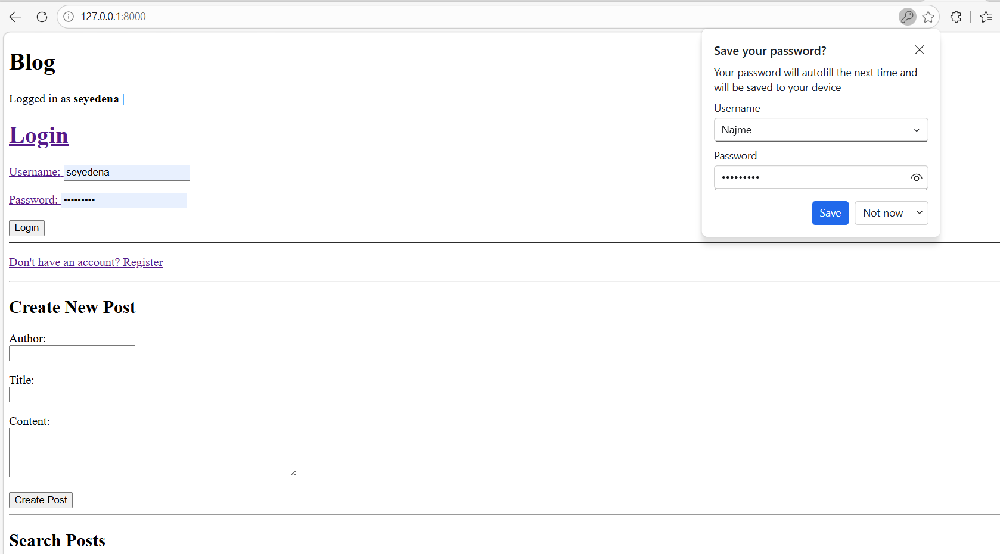
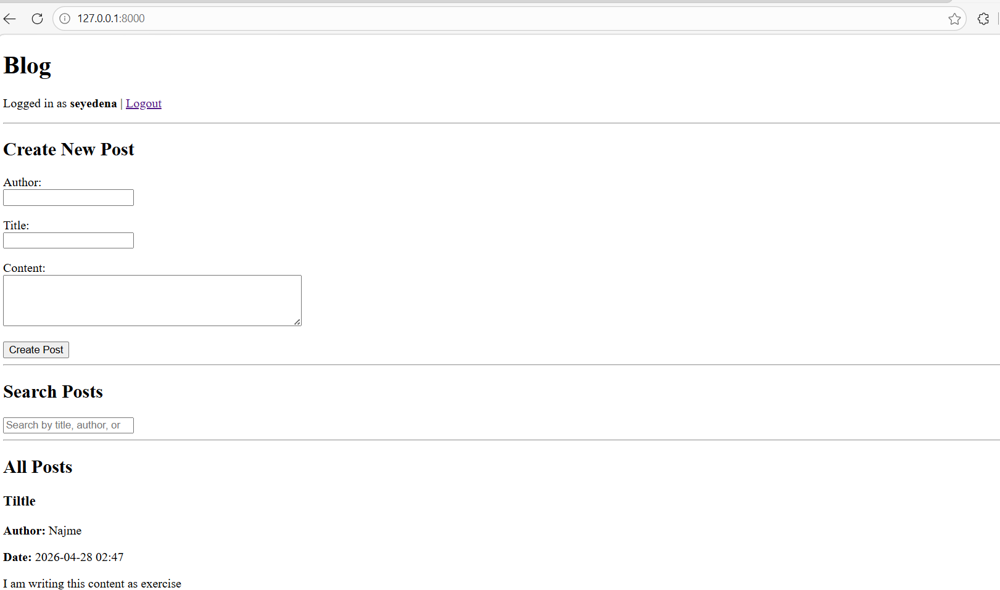

#  Django Blog App with HTMX & Authentication

A high-performance, single-page blog application built with **Django Class-Based Views (CBV)** and **HTMX**. This project features full CRUD operations and a live search system—all without full page reloads.

# Key Features
- **Single Page Experience:** Powered by HTMX for seamless content updates.
- **Full Authentication:** Secure Login, Register, and Logout systems.
- **Ownership Control:** Users can only Edit or Delete their own posts.
- **Live Search:** Instant filtering of posts by title, author, or content.
- **CBV Architecture:** Built using Django's best practices with Class-Based Views.

# Screenshots

# 1. Login & Registration
Secure entry point for users to manage their blog posts.

# 2. Main Dashboard & Live Search
The central hub showing all posts with real-time search functionality.

